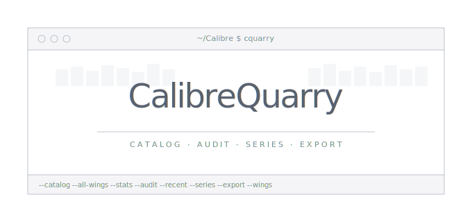

<p align="center">
  
</p>

<p align="center">
  <a href="https://www.python.org/"></a>
  <a href="LICENSE"></a>
  <a href="https://ko-fi.com/vrnvctss"></a>
</p>

A CLI toolkit for Calibre users who treat their libraries as curated collections. Reads `metadata.db` directly — no `calibredb` dependency, no JSON intermediaries, no external libraries. Pure Python stdlib.

## Why this exists

Calibre is a good database. It is not a good reporting tool. If you maintain a large library (3000+ books) organized with virtual libraries, hierarchical tags, and series tracking, you eventually want answers to questions Calibre's UI doesn't surface well: which series have gaps, how many books are unrated, what does a given wing actually contain, and can I get a machine-readable export without running `calibredb list` through a parser script.

This tool reads the SQLite database directly in read-only mode. It resolves Calibre's virtual library search expressions (including `tags:`, `vl:` cross-references, and boolean operators), so your existing wing definitions work without being re-encoded anywhere.

## Features

| Mode | Flag | Description |
|------|------|-------------|
| **Catalog** | `--catalog` | Formatted text catalog grouped by author, with ratings and series info |
| **All wings** | `--all-wings` | Generate a separate catalog file for every virtual library |
| **Statistics** | `--stats` | Format breakdown, rating distribution, tag taxonomy, publisher counts |
| **Audit** | `--audit` | Report untagged, unrated, and coverless books; detect series gaps |
| **Recent** | `--recent N` | Show the N most recently added books (default: 20) |
| **Series** | `--series` | List all series with completeness status and gap detection |
| **Export** | `--export` | Full library export to JSON or CSV for external tools |
| **Wings** | `--wings` | List all virtual libraries with book counts |

Running with no arguments launches an interactive menu.

## Requirements

None beyond Python 3.9+. The script uses only stdlib modules (`sqlite3`, `json`, `csv`, `argparse`). No pip install required.

## Usage

```bash
# Build a catalog for a specific wing
python getBooks.py --catalog --wing "The Tabletop" --primary-only --db ~/Calibre/metadata.db

# Generate catalogs for all virtual libraries at once
python getBooks.py --all-wings --db ~/Calibre/metadata.db --outdir ~/docs/catalogs

# Library statistics
python getBooks.py --stats --db ~/Calibre/metadata.db

# Audit: find unrated books, missing tags, series gaps
python getBooks.py --audit --db ~/Calibre/metadata.db --output audit.csv

# Recently added books
python getBooks.py --recent 10 --db ~/Calibre/metadata.db

# Series completeness and gap detection
python getBooks.py --series --db ~/Calibre/metadata.db

# Export full library to JSON
python getBooks.py --export --db ~/Calibre/metadata.db --format json --output library.json

# List all virtual library wings with counts
python getBooks.py --wings --db ~/Calibre/metadata.db
```

If `metadata.db` is in the current directory or at `~/Calibre Library/metadata.db`, the `--db` flag can be omitted.

## Sample output

### Catalog (`--catalog`)

```
Calibre Library Export — 2026-03-27 19:38 [The Tabletop]
========================================================

[Avery Alder]
-------------
  * The Quiet Year [PDF]

[Emmy Allen]
------------
  * The Gardens of Ynn [PDF]
  * The Stygian Library [PDF]

[Aaron Allston]
---------------
  * Dungeons and Dragons Rules Cyclopedia [PDF] [★★★★☆ 4.0/5]
```

### Statistics (`--stats`)

```
=== Library Statistics (3853 books) ===

Formats:
  EPUB    2571  ██████████████████████████
  PDF     1208  ████████████
  DJVU      65
  MOBI       8
  AZW3       3

Ratings:
  ★★★   (3.0)     81  █
  ★★★★  (4.0)   2031  ████████████████████████████████████████
  ★★★★★ (5.0)    135  ██
  Unrated:        1579  (41.0%)

Tag taxonomy (392 tags):
  NonFic: 276 tags
  Fic: 98 tags
  Gaming: 17 tags
```

### Series (`--series`)

```
  A Song of Ice and Fire: 5 of 5 (complete)
  Asian Saga: Chronological Order: 4 of 6 (incomplete)  ⚠ missing: 2, 3
  Aubrey-Maturin: 20 of 20 (complete)
  Discworld: 41 of 41 (complete)
  Parker: 10 of 18 (incomplete)  ⚠ missing: 8, 9, 10, 11, 12, 13, 14, 15
```

## Virtual library resolution

The script parses Calibre's virtual library definitions directly from the `preferences` table. These are the same search expressions Calibre uses internally:

```
Fantasy Wing:    tags:"Fic.Fantasy" or tags:"Fic.Speculative.Fantasy"
The Tabletop:    tags:"Gaming.TTRPG"
Unsorted:        not (vl:"The Tabletop" or vl:"Fantasy Wing" or ...)
```

Supported operators: `tags:Pattern`, `tags:"=Exact"`, `vl:Name`, `or`, `and`, `not`, parentheses. Tag matching follows Calibre's hierarchical convention — `tags:Fic.Fantasy` matches `Fic.Fantasy`, `Fic.Fantasy.Epic`, `Fic.Fantasy.Grimdark`, etc.

## How it reads the database

The script opens `metadata.db` in read-only mode (`?mode=ro`). It never writes to the database. All data comes from standard Calibre tables: `books`, `authors`, `tags`, `series`, `ratings`, `data`, `publishers`, `languages`, and `preferences`. No custom columns are required.

Calibre stores ratings on a 0–10 scale internally (where 10 = 5 stars). The script converts to the standard 0–5 star display automatically.

## Replacing shell-based catalog pipelines

If you previously generated catalogs through a `calibredb list → JSON → parser` pipeline, `--all-wings` replaces that entire workflow with a single command. No temp files, no intermediate JSON, no shell glue functions.

## Full help output

```
usage: getBooks.py [-h]
                   [--catalog | --all-wings | --stats | --audit | --recent [RECENT]
                   | --series | --export | --wings] [--db DB] [--wing WING]
                   [--output OUTPUT] [--outdir OUTDIR] [--format {json,csv}]
                   [--primary-only] [--quiet]

Calibre library toolkit: catalog, stats, audit, export

options:
  -h, --help           show this help message and exit
  --catalog            Build a text catalog
  --all-wings          Generate catalogs for all virtual libraries
  --stats              Show library statistics
  --audit              Report issues (untagged, unrated, series gaps)
  --recent [RECENT]    Show N most recently added books (default: 20)
  --series             List all series with completeness and gap detection
  --export             Export library to JSON or CSV
  --wings              List all virtual library wings
  --db DB              Path to Calibre metadata.db (auto-detected if omitted)
  --wing WING          Filter to a specific virtual library wing
  --output OUTPUT      Output file path
  --outdir OUTDIR      Output directory for --all-wings (default: current dir)
  --format {json,csv}  Export format (default: json)
  --primary-only       Use only the first author (useful for TTRPG collections)
  --quiet              Minimize output
```

## Support

If this saved you time, consider [buying me a coffee](https://ko-fi.com/vrnvctss).
